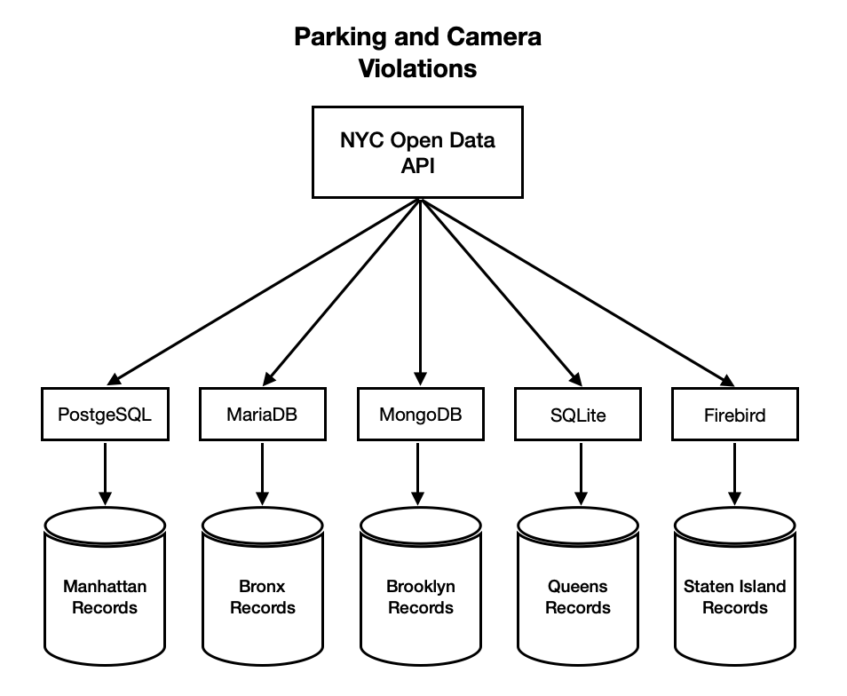
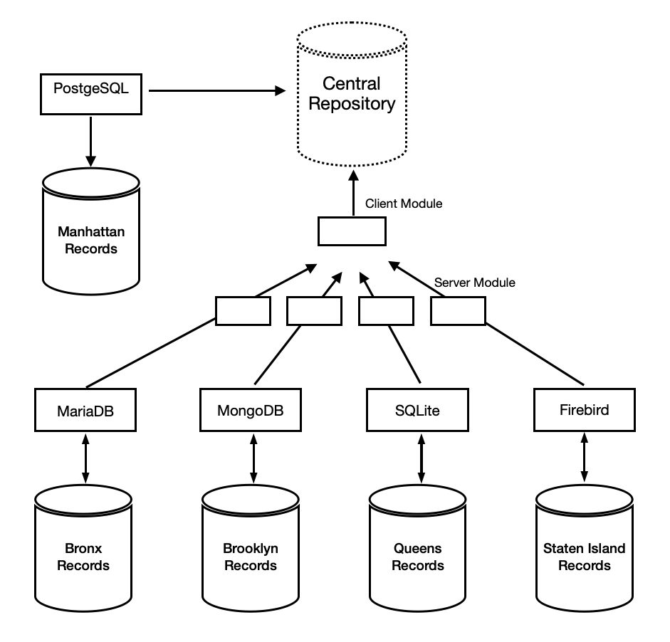
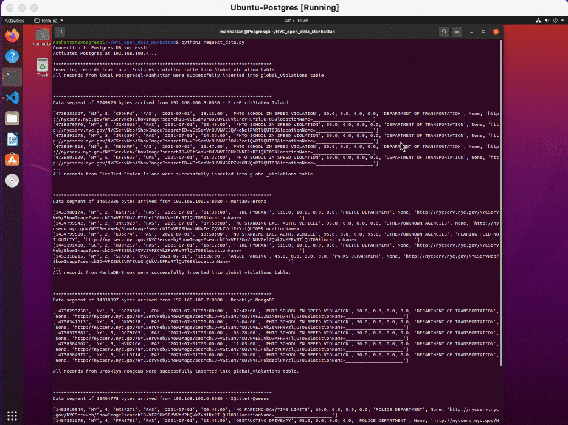
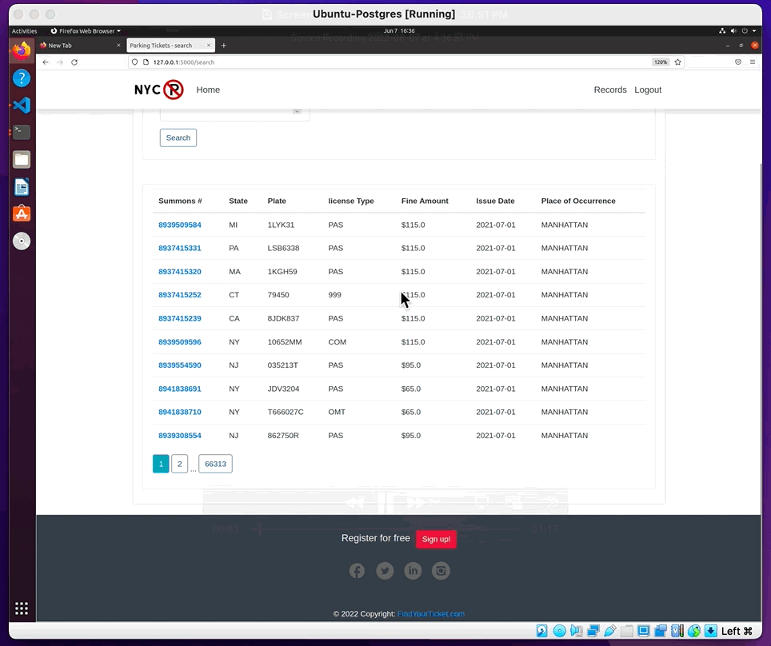
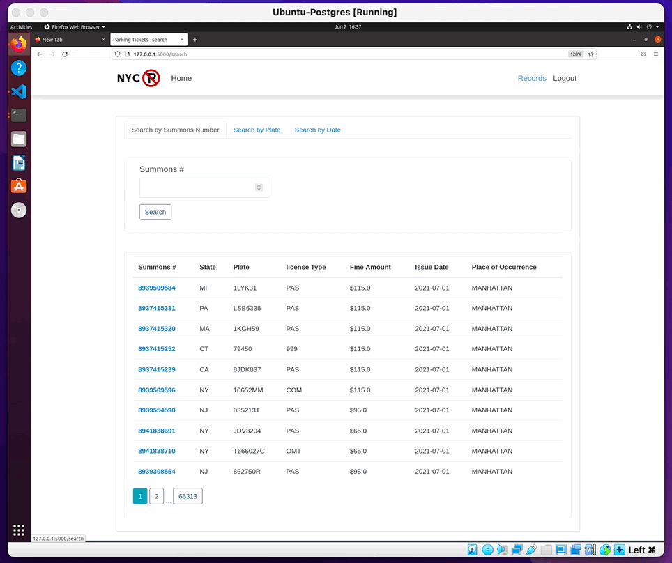

# Distributed Database - NYC Parking and Camera Violations Web application
This application will gather all or portions of data from physically distributed databases and merge it into a central repository. There will be five databases managed by five different DBMS,  four relational databases(SQL), and one non-relational data structure(NoSQL). In addition, each database will contain parking and camera violation records of one of the five boroughs of New York City. 

## Data Decentralization

We will assume that all parking and violation records are physically distributed among the five boroughs of NYC. Thus, we will use the NYC Open Data API to retrieve the data needed and store it in five computers managed by five different DBMS. The data will be distributed among four relational databases(SQL), PostgreSQL, MariaDB, SQLite, Firebird, and a non-relational data structure(NoSQL), MongoDB. All records will be stored as follows.
- Records from Manhattan will be stored in a PostgreSQL database.
- Records from The Bronx will be stored in a MariaDB database.
- Records from Brooklyn will be stored in a MongoDB database.
- Records from Queens will be stored in an SQLite database.
- Records from Staten Island will be stored in a FireBird database.

## Data Preparation 
In this step, data is cleaned and structured into the desired format. Thus, we will remove duplicated records and delete those with invalid date entries. 
All databases will be created on distinct virtual machines using python and database libraries.

## Federated Data - Reconstruction
Data reconstruction will occur in one local host where a central repository will be created. This local host, PostgreSQL, will act as a client, and the other four databases will act as servers. The client will request the other databases to send their data segment. After receiving the data segments from all databases and reconstructing and storing them into the local repository, the client is able to process any query to retrieve data from the data collected.

Python and JSON modules are great tools that will help us transfer data between heterogeneous databases. Additionally, we will use WebSockets and Asycio libraries to build a client and server websocket. 

Requesting records from all boroughs - July 2021.

Once a Connection is established at each computer, the client can request data as many times as needed. 

Requesting records: 
- July 01, 2021 - July 10, 2021
- July 01, 2021 - July 31, 2021  

### Video Walkthrough

## Flask Web Application
For this last step, we will use Flask Python web application framework. This web application will allow us to visualize all data collected across the databases.

### Video Walkthrough

It will also have some implementation that will let us filter the data by a data range or either look for a specific record giving the summons number or a car plate.
### Video Walkthrough

